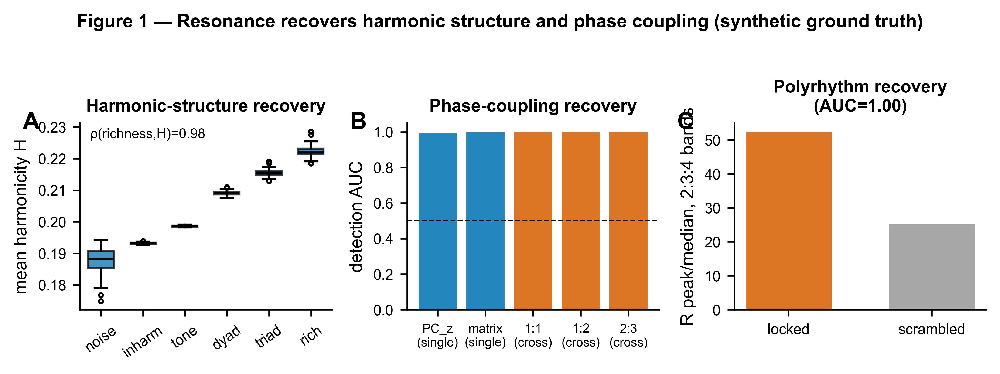
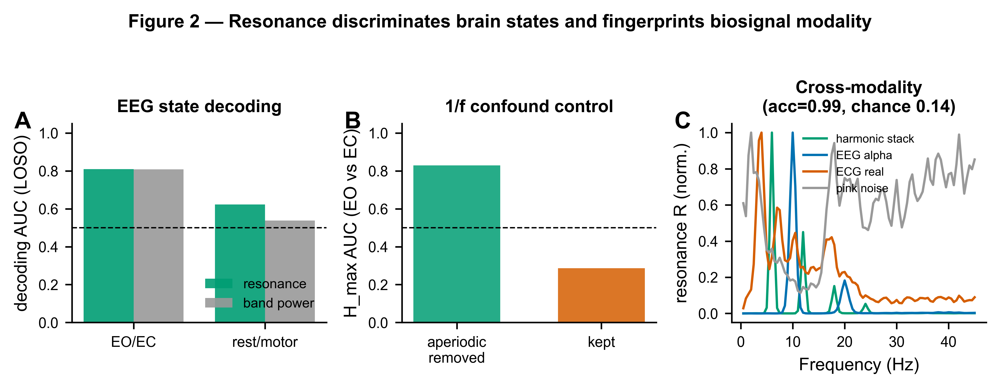
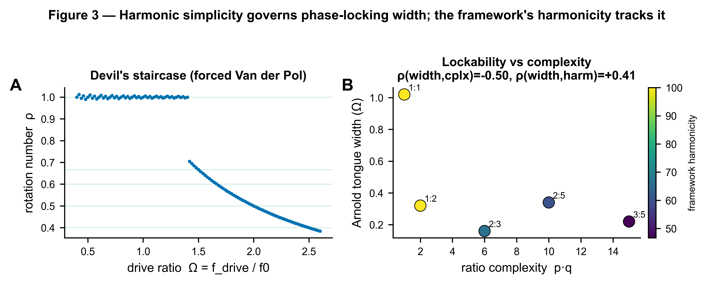
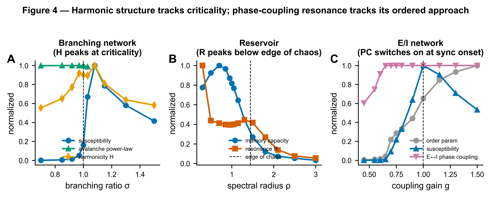

# biological-resonance

**Quantifying resonance in biological systems.**

This repository is the validation suite and methods-paper material for a new way
of characterizing biosignals: a *tripartite resonance representation* built on
top of the [`biotuner`](https://github.com/AntoineBellemare/biotuner) library.
Every signal is described by three frequency-resolved spectra,

| spectrum | symbol | what it measures |
|----------|--------|------------------|
| **harmonicity**    | `H(f)`  | how harmonically organized the spectrum is around `f` |
| **phase coupling** | `PC(f)` | n:m phase locking involving `f` |
| **resonance**      | `R(f) = H(f) × PC(f)` | where harmonic structure *and* phase coupling coincide |

plus complexity summaries, surrogate-normalized inference, and a
strategy-registry so kernels / coupling metrics can be swapped and compared. The
same machinery extends to **cross-signal** resonance (signal ↔ signal, channel ↔
channel) via `biotuner.harmonic_connectivity`.

The suite tests this representation against synthetic ground truth, real
biosignals (EEG, ECG, PPG, respiration), and several generative dynamical systems
(forced/coupled oscillators, echo-state reservoirs, branching networks,
Wilson–Cowan E/I networks).

---

## Headline results

All numbers below are produced by the paper-grade pass and stored in
[`resonance_paper/results/`](resonance_paper/results); the figures are
regenerated from those JSONs by
[`resonance_paper/paper/make_paper_figures.py`](resonance_paper/paper/make_paper_figures.py).

1. **Harmonic-structure recovery is essentially perfect.** Mean harmonicity `H`
   rank-orders a ladder of synthetic signals by harmonic richness (Spearman
   ρ = 0.98); harmonic-vs-inharmonic and tone-vs-noise separation are at
   AUC = 1.0.
2. **Phase-coupling detection succeeds** once the phase rows are aligned to the
   analysis frequencies and read against a PSD-preserving (AAFT) null:
   single-signal `PC_z` AUC ≈ 0.99 and the matrix entry Φ[f₁,f₂] AUC = 1.0;
   cross-signal n:m locks (1:1 / 1:2 / 2:3) detect at AUC = 1.0 each (vs a
   single-signal baseline of 0.59). Raw reduced `PC` is small and PSD-weighted —
   coupling must be read as a surrogate z-score, not in absolute terms.
3. **Polyrhythmic structure is recovered** — the 2:3:4 resonance peak/median
   ratio separates locked from scrambled stacks at AUC = 1.0.
4. **Resonance features discriminate brain states.** Eyes-open vs eyes-closed
   decodes at AUC ≈ 0.81 (matching band power) and rest-vs-motor at AUC ≈ 0.62
   (vs 0.54 for band power), leave-one-subject-out, permutation p = 0.001.
5. **Harmonicity is 1/f-confounded — and the suite controls for it.** Peak
   harmonicity discriminates eyes-open/closed at AUC = 0.83 *with* FOOOF-style
   aperiodic removal but collapses to 0.29 *without* it. Cross-condition
   comparisons **must** use `remove_aperiodic=True`.
6. **The feature vector fingerprints modality.** A 7-way classifier over
   resonance + complexity features separates ECG / EEG / PPG / RSP / harmonic /
   noise at accuracy 0.99 (chance 0.14, permutation p = 0.005).
7. **Harmonic simplicity governs lockability.** For a forced Van der Pol
   oscillator, Arnold-tongue width vs ratio complexity correlates ρ = −0.50, and
   the framework's harmonicity tracks tongue width at ρ = +0.41.
8. **Resonance maps onto criticality, not raw computation.** Harmonic structure
   `H` peaks at the critical branching ratio (σ ≈ 1); reservoir resonance peaks
   in the ordered regime *below* the edge of chaos (and does **not** track memory
   capacity, ρ = −0.32 — an honest null); cross E↔I phase coupling switches on at
   the synchronization onset of a Wilson–Cowan network.

## Figures









---

## Installation

```bash
git clone https://github.com/AntoineBellemare/biological-resonance.git
cd biological-resonance
pip install -r requirements.txt
```

> **Note on the biotuner dependency.** The resonance fixes this suite relies on
> (phase-row alignment to the analysis grid; factor-level surrogate z-scores)
> landed on biotuner `main` *after* the v0.4.1 PyPI release, and the version was
> not bumped. `pip install biotuner` therefore installs a build that **does not
> reproduce these results**. `requirements.txt` pins biotuner to `main`
> (`git+https://github.com/AntoineBellemare/biotuner.git@main`). Once a biotuner
> release (≥ 0.4.2) ships these fixes, this can be relaxed to a PyPI pin.

EEG data auto-downloads via `mne.datasets.eegbci` (PhysioNet) on first run and is
cached under `~/mne_data`. ECG/PPG/RSP are simulated with `neurokit2`.

## Reproducing the results

```bash
# quick pass (minutes) — for iteration
python -m resonance_paper.run_all

# paper-grade pass (long: more seeds, 100-200 surrogates) — regenerates results/
python -m resonance_paper.run_all --paper

# a single study
python -m resonance_paper.run_all --only 1
python -m resonance_paper.study2_eeg_states --paper

# rebuild the composite paper figures from the stored result JSONs (fast)
python -m resonance_paper.paper.make_paper_figures
```

Surrogate loops are parallelized with `joblib`. Run all commands from the
repository root (the studies form the importable `resonance_paper` package).

---

## Study index

| # | File | Question | Data | Result |
|---|------|----------|------|--------|
| 1 | [study1_ground_truth.py](resonance_paper/study1_ground_truth.py) | Recover known harmonic structure & n:m coupling? | synthetic | H ranks richness ρ=0.98; coupling PC_z AUC 0.99, matrix 1.0 |
| 2 | [study2_eeg_states.py](resonance_paper/study2_eeg_states.py) | Separate brain states? | PhysioNet eegbci | EO/EC 0.81, rest/motor 0.62 (LOSO, p=0.001) |
| 3 | [study3_cross_modality.py](resonance_paper/study3_cross_modality.py) | Fingerprint signal modality? | EEG+ECG+PPG+RSP+synthetic | 7-way acc 0.99 (chance 0.14) |
| 4 | [study4_strategy_comparison.py](resonance_paper/study4_strategy_comparison.py) | Which strategy for which goal? | synthetic | 20 strategies scored; `harmsim·binary·nm_plv` AUC 1.0 |
| 5 | [study5_cross_signal.py](resonance_paper/study5_cross_signal.py) | Cross-signal coupling recovery (1:1/1:2/2:3)? | synthetic pairs | AUC 1.0 each vs 0.59 single-signal baseline |
| 6 | [study6_resonance_conjunction.py](resonance_paper/study6_resonance_conjunction.py) | Polyrhythm (2:3:4) recovery? | synthetic | AUC 1.0 |
| 7 | [study7_coupled_oscillators.py](resonance_paper/study7_coupled_oscillators.py) | Coupled Van der Pol H/PC/R co-variation | generative | Direction A sound; **Direction B confounded** — excluded from the sweep (see file caveat) |
| 8 | [study8_arnold_tongues.py](resonance_paper/study8_arnold_tongues.py) | Does harmonic complexity govern lockability? | forced Van der Pol | width~complexity ρ=−0.50, width~harmonicity ρ=+0.41 |
| 9 | [study9_reservoir.py](resonance_paper/study9_reservoir.py) | Resonance vs reservoir memory? | echo-state network | R vs memory ρ=−0.32 (honest null) |
| 10 | [study10_criticality.py](resonance_paper/study10_criticality.py) | Resonance vs criticality (avalanches)? | branching network | H peaks at σ≈1; R≈0 (avalanches non-oscillatory) |
| 11 | [study11_reservoir_criticality.py](resonance_paper/study11_reservoir_criticality.py) | Resonance vs the edge of chaos? | echo-state network | R peaks in the ordered regime, below the edge of chaos |
| 12 | [study12_ei_network.py](resonance_paper/study12_ei_network.py) | Resonance vs the edge of synchronization? | Wilson–Cowan E/I | cross E↔I phase coupling switches on at sync onset |

Study 7 is retained for the record but **excluded from the default sweep**: its
Direction B is confounded (natural frequencies set at exact rational ratios, so
the n:m phase combination cancels deterministically regardless of coupling). A
correct Arnold-tongue test with detuned frequencies and real coupling lives in
Study 8.

## Methods notes

- **Factor-level surrogate inference.** The suite z-scores each factor (`H`,
  `PC`, `R`) per frequency against the *same* PSD-preserving surrogate ensemble
  (`resonance_paper/_common.py::factor_surrogate_z`). This is what makes
  phase-coupling detection work: raw reduced `PC` is PSD-weighted and small, but
  `PC_z` cleanly separates locked from unlocked signals.
- **Aperiodic removal is mandatory across conditions.** On pure colored noise,
  harmonicity rises monotonically with the 1/f slope. Use
  `ResonanceConfig(remove_aperiodic=True)` whenever conditions differ in
  background 1/f (arousal, task/rest, eyes open/closed, age, anesthesia).

## Repository layout

```
biological-resonance/
├── README.md  requirements.txt  .gitignore
└── resonance_paper/                  # the importable analysis package
    ├── _common.py                    # config presets, surrogate-z, AUC/stats, plotting
    ├── signals.py  datasets.py       # synthetic generators / real-data loaders
    ├── study1..12_*.py  run_all.py   # the studies + driver
    ├── results/   *.json             # paper-grade headline metrics (committed)
    ├── figures/   study*_*.{png,pdf} # per-study diagnostic figures
    └── paper/
        ├── resonance_paper_draft.md          # main manuscript draft
        ├── resonance_and_criticality.md      # studies 9–12 synthesis
        ├── make_paper_figures.py             # builds the composite Fig 1–4
        └── figures/   Fig1..4_*.{png,pdf}    # publication composites (600 DPI)
```

The package is named `resonance_paper` because it *is* the paper's reproducible
validation suite; the manuscript and stored result JSONs reference that path.

## Relationship to biotuner

The resonance engine itself (kernels, phase estimators, coupling metrics,
orchestration, surrogate nulls, cross-signal connectivity) lives in the
[`biotuner`](https://github.com/AntoineBellemare/biotuner) library under
`biotuner.resonance` and `biotuner.harmonic_connectivity`. This repository holds
only the validation/paper work that depends on it.

## License

See the upstream [`biotuner`](https://github.com/AntoineBellemare/biotuner)
project; a license file will be added here to match.
